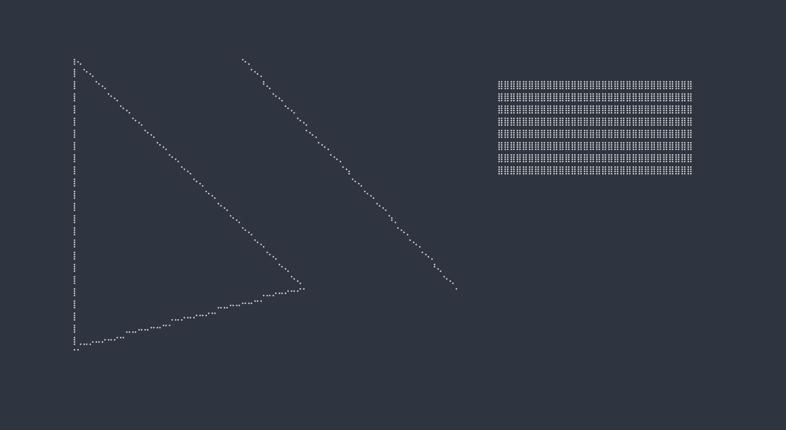
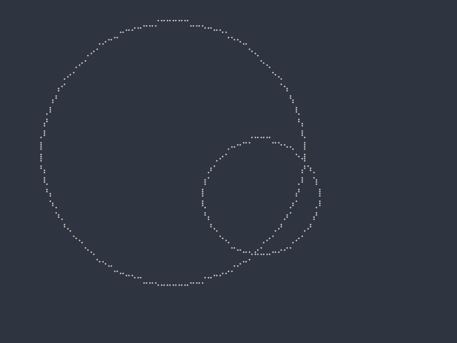

# plutonem

<p> A library to draw pixels in the terminal </p>

### Building
To generate `libpluto.a`, run:
```
make
```
To compile some examples, run:
```
make test
```


### Using the library

1. Include the pluto header in your source file
```
#include <path to pluto.h>
```

2. Write your source code. An example program which draws a line:
```
// program.c
#include "pluto.h"

int main()
{
    struct pluto_struct_t demo;

    pluto_init_mode(&demo);                 // Initializes pluto
    pluto_clear(&demo);                     // Clears the screen
    pluto_draw_line(&demo, 5, 10, 20, 25);  // Draws a line from (5x, 10y) to (20x, 25y)
    pluto_close_mode(&demo);                // Closes pluto

    return 0;
}
```

3. Link all of the library object files generated, for example:
```
gcc -o program program.c -L<path to where libpluto.a is located> -lpluto
```

4. You're done! Just run your program now!

<p>Example shapes</p>

<br>
<p>Intersecting circles drawn using plutonem</p>


### Troubleshooting

1. Check if proper fonts are installed. Pluto uses Unicode characters from `\u2800` to `\u28FF`
2. Check if your terminal supports Unicode
3. Idk
