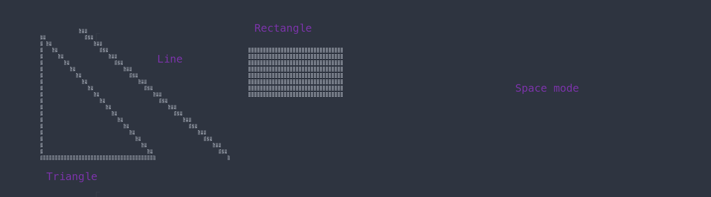

# plutonem

 A library to draw pixels in the terminal 

### Building
`make`

### Using the library
`#include "path_to_pluto.h"`
`gcc file.c <cflags> <path to pluto.o> -o outfile`

Example is in the src directory

The example file might not work as I used a big terminal to run it

Example shapes in space mode

