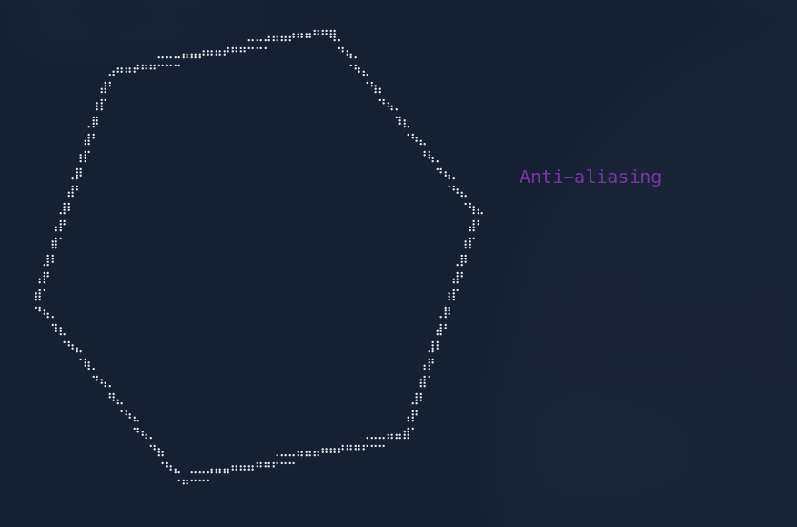
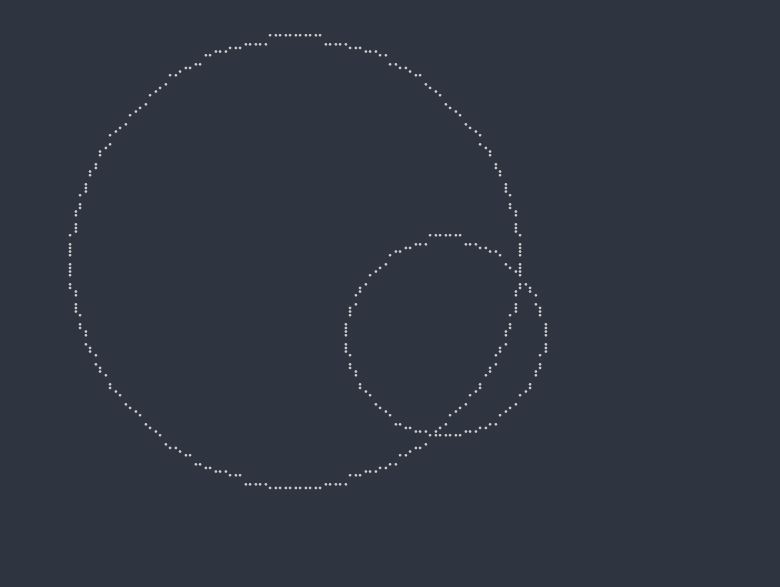
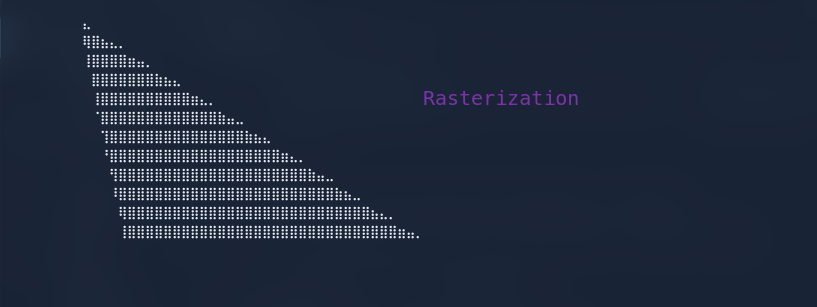

<p> A library to draw graphics with pixels in the terminal </p>

### Building
To generate `libpluto.a`, run:
```
$ make
```
To install it so that gcc can use it directly, run:
```
# make install
```
To compile some examples, run:
```
$ make test
```

### Using the library

1. Include the pluto header in your source file
```
#include <path to pluto.h> // do #include <pluto.h> if the lib is already installed
```

2. Write your source code. An example program which draws a line:
```
// program.c
#include "pluto.h"
// If you have installed the library, you can do #include <pluto.h>

int main()
{
    pluto_canvas_t *canvas = pluto__init_canvas(1);              // Initializes pluto canvas. If the first arg is not 0, canvas uses antialiasing
    pluto__clear(canvas);                                        // Clears the canvas
    pluto__draw_line(canvas, (pt_t){5, 10}, (pt_t){20, 25});     // Draws a line from (5x, 10y) to (20x, 25y)
    pluto__free_canvas(canvas);                                  // Frees canvas

    return 0;
}
```

3. Link all of the library object files generated, for example:
```
$ gcc -o program program.c -L<path to the FOLDER where libpluto.a is located> -lpluto  # if you have installed the lib already, there is no need to use -L
```

4. You're done! Just run your program now!

<p>Polygons</p>

<br>
<p>Intersecting circles drawn using plutonem</p>



### Troubleshooting

1. Check if proper fonts are installed. Pluto uses Unicode characters from `\u2800` to `\u28FF`. I recommend the `Cascadia` font for best quality.
2. Check if your terminal supports Unicode
3. Check your locale, lang. I have my locale set to `en_US.UTF-8`. On Arch Linux, which I use, I would use this command to set it:
```
# localectl set-locale LANG=en_US.UTF-8
```
4. Idk
